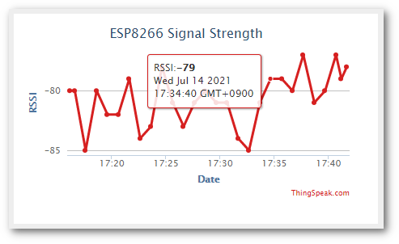

# mqttRSSI_FS.ino

Sketch experience with JSON for custom web pages and MQTT broker settings placed in the ESP file system.

This sketch presents an implementation example to place the custom web page JSON and MQTT broker settings into the file system of the ESP module. It is based on [mqttRSSI.ino](../../mqttRSSI), which demonstrates publishing the WiFi signal strength of the ESP module via MQTT.

To get the experience of this sketch correctly, you need to upload the files contained in the data folder to the file system of the ESP module in advance.

### Upload the custom web page JSON descriptions and pre-defined parameters

At the first, it is important to erase your ESP module before starting the project.  Erasing the ESP module ensures that the files required by the sketch are mounted on the file system. 

Then open Arduino IDE and load mqttRSSI_FS sketch from the menu using **File > Examples > AutoConnect > mqttRSSI_FS**.
The data folder under the mqttRSSI_FS holds the following three files:

- `mqtt_setting.json`: JSON description of custom web page that should be assigned to `/mqtt_setting`.
- `mqtt_save.json`: JSON description of custom web page that should be assigned to `/mqtt_save`.
- `param.json`: The default values for the public channel settings on Thingspeak.com. This file keeps the values you will set.

To upload these files, choose Data Upload from Arduino IDE menu via **Tools > ESP8266 LittleFS Data Upload** or **one of the Upload** that fits your module.

### Build the sketch and start project

Run the build in the Arduino IDE. Arduino IDE will compile the sketch successfully and uploads it to the ESP module. You can open the serial monitor in advance to monitor the execution status of the sketch. Set the baud rate of the serial monitor to 115200 bps.

The first time you execute mqttRSSI_FS, the captive portal will launch due to cannot connect to the Internet, and you will see the WiFi access point as `ESP-XXXXXX` or `esp8266ap`, `esp32ap` via your cellphone. Connect to it and use [Configure new AP](https://hieromon.github.io/AutoConnect/menu.html#configure-new-ap) from the [AutoConnect menu](https://hieromon.github.io/AutoConnect/menu.html) will allow the ESP module to connect to WiFi Access Point to reach the Internet.
Also, while the ESP module is in the captive portal state, you can open the MQTT Setting menu and set the access parameters to a public channel you have created on Thingspeak.com.

The web pages you will see at this time are custom web pages created by AutoConnect based on `mqtt_setting.json` and `mqtt_save.json`.

### Monitoring the WiFi signal strength as RSSI

Once the ESP module is restarted using [Reset](https://hieromon.github.io/AutoConnect/menu.html#reset) from the AutoConnect menu after a successful connection to the Internet, publishing RSSI values will begin. You can see the RSSI fluctuations from the client browser.

